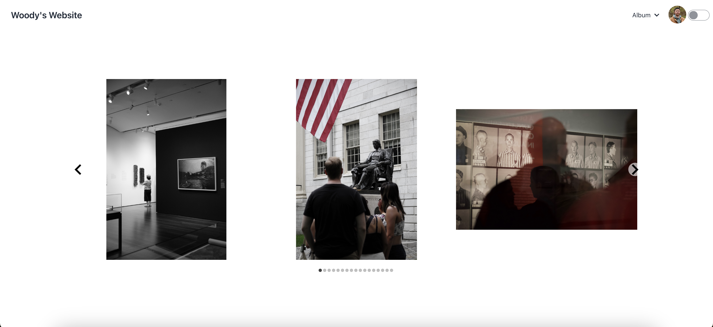
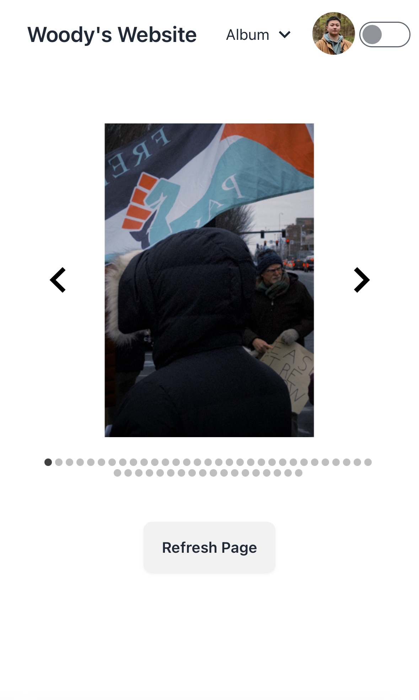
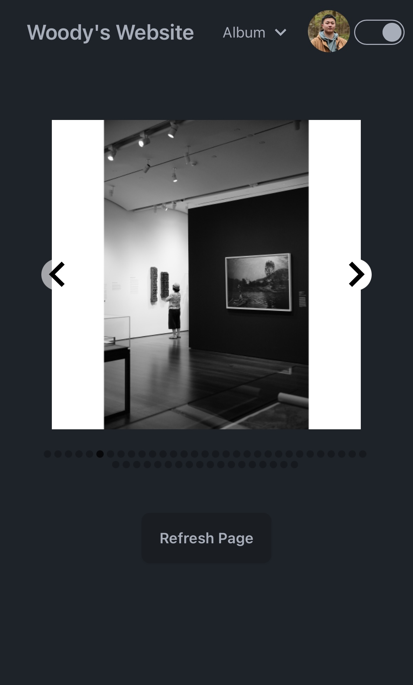

# React Album

## Description
This website is fully built on React and Daisy UI (Tailwind CSS). Every time I make a push on the project, the GitHub Action will automatically `npm install` all the dependencies and generates a GitHub Page based on the react `build` folder.

https://woodylinwc.github.io/React-Album/

## Technologies
- ReactJS
    ```
    npx create-react-app React-Album --template typescript
    ```
- Typescript

- Node.js 

- GitHub Action

    [publish.yml](./.github/workflows/publish.yml)
    ```
    cd .github/workflows/publish.yml
    ```
- Tailwind CSS

    [Tailwind CSS Installation](https://tailwindcss.com/docs/installation)
    
- Daisy UI
    ```
    npm i -D daisyui@latest
    ```

## Features
- Dynamically adjusting the image carousel based on screen size.





- Support light and dark mode (Daisy UI).



## License 
MIT


<!-- # Todo
- Make a refresh button
- Refine the phone view
- Upload some demo images -->


